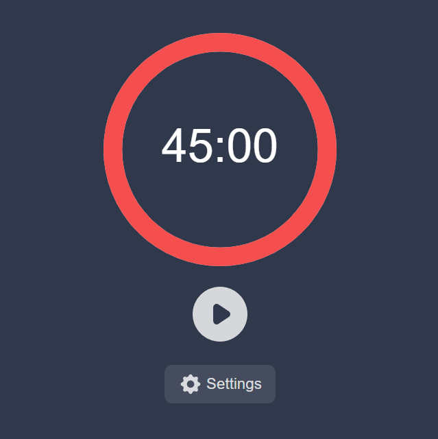

# react-pomodoro2
<h1 align="center">
  Pomodoro
</h1>

  <a href="#-tecnologias">Tecnologias</a>&nbsp;&nbsp;&nbsp;|&nbsp;&nbsp;&nbsp;
  <a href="#-projeto">Projeto</a>&nbsp;&nbsp;&nbsp;|&nbsp;&nbsp;&nbsp;
  <a href="#-deploy">Deploy</a>&nbsp;&nbsp;&nbsp;&nbsp;&nbsp;&nbsp;

 

  

## 🚀 Tecnologias

Esse projeto foi desenvolvido com as seguintes tecnologias:

- ReactJs
- Sass

## 💻 Projeto

Timer para auxiliar na utilização da técnica pomodoro, com opções de tempo de foco e tempo de repouso configuráveis.

## 🔖 Deploy

[Pomodoro](https://lmpomodoro.netlify.app/)
---
